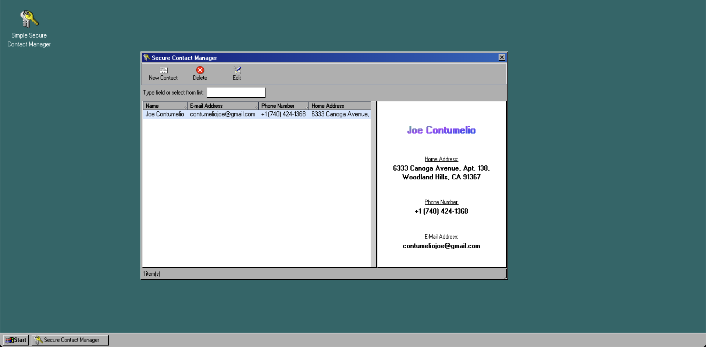

### 🔑 Simple Secure Contact Manager

A fully encrypted contact manager built on React and written in Typescript. It uses
custom TailwindCSS for a Windows 98 aesthetic

## 

### Overview

This program was written by me, Joe Contumelio, for Radix's assessment.
The project took roughly 10 hours to complete. Here's a list of each
feature that was requested and completed:

- [x] access to application data controlled by password
- [x] decrypt and load contact file from disk, or create new file if none existing
- [x] be able to detect if the correct password was used without displaying corrupted or garbage data
- [x] add new contacts
- [x] edit existing contacts
- [x] search contacts by any field
- [x] write encrypted modified contacts datafile to disk

---

### Getting Started

#### Prerequisites

- NPM (or yarn)

#### Setup

1. Clone this repo: `git clone https://github.com/JosephCon1998/secure-contact-manager.git`

2. run `npm install` or `yarn` inside the project directory

3. run `npm start` or `yarn start`
