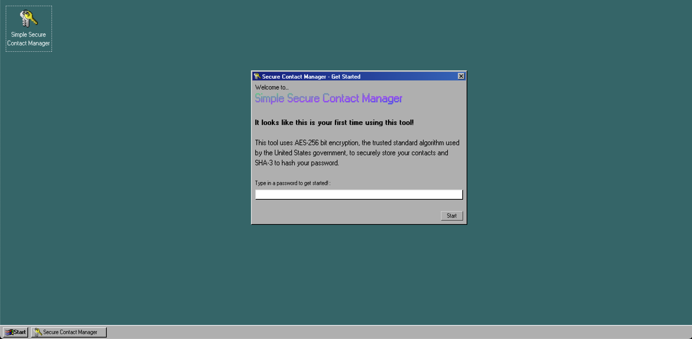
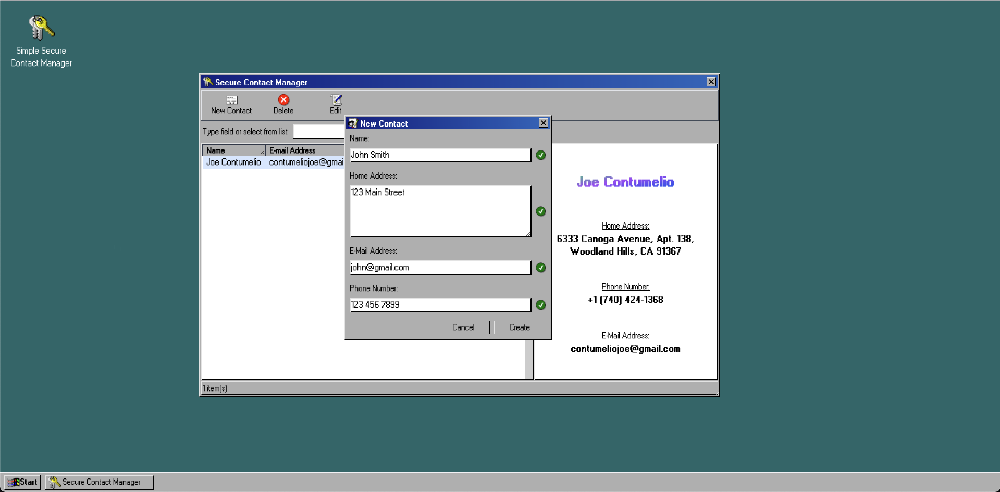
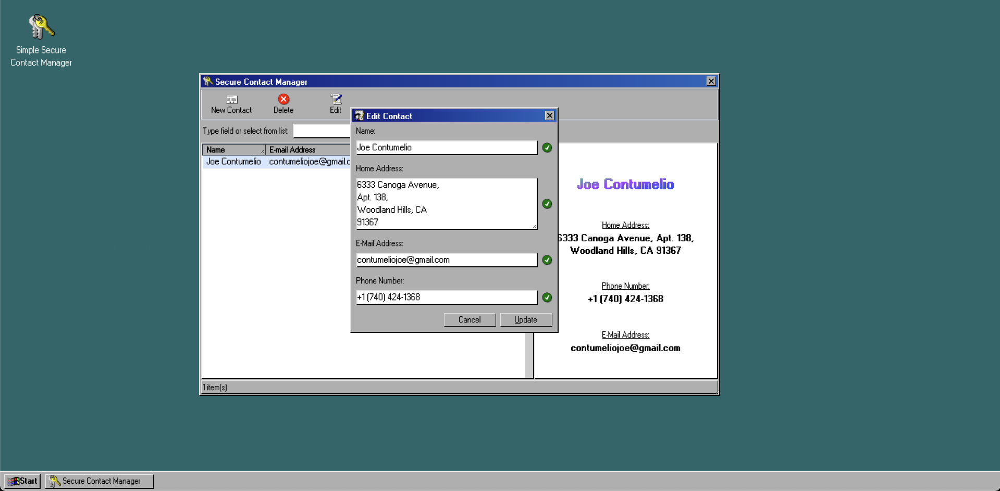
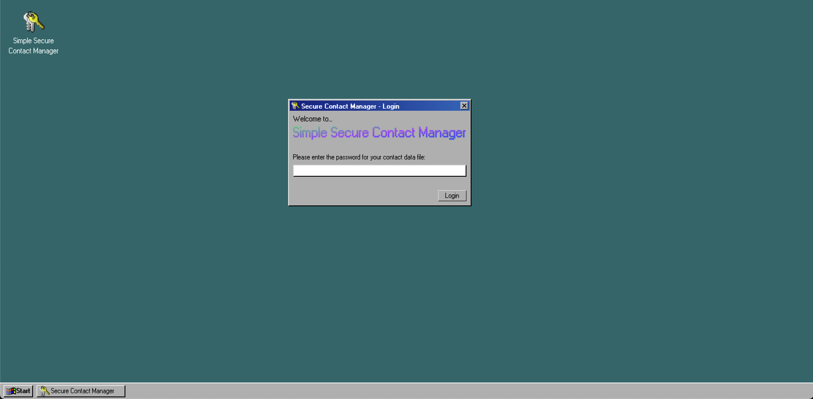
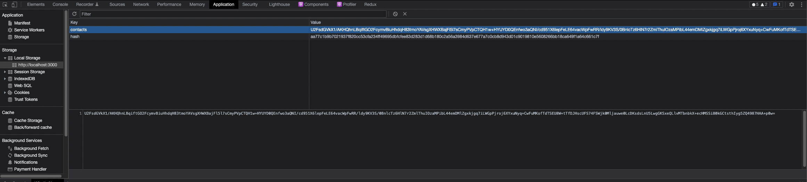

### 🔑 Simple Secure Contact Manager

A fully encrypted contact manager built on React and written in Typescript. It uses
custom TailwindCSS for a Windows 98 aesthetic

## 

### Overview

This program was written by me, Joe Contumelio, for Radix's assessment.
The project took roughly 10 hours to complete. Here's a list of each
feature that was requested and completed:

- [x] access to application data controlled by password
- [x] decrypt and load contact file from disk, or create new file if none existing
- [x] be able to detect if the correct password was used without displaying corrupted or garbage data
- [x] add new contacts
- [x] edit existing contacts
- [x] search contacts by any field
- [x] write encrypted modified contacts datafile to disk

---

### My Environment

| Key                | Value               |
| :----------------- | :------------------ |
| Operating System   | macOS 12.0.1        |
| Browser            | Chrome              |
| Computer           | Mac Mini w/ M1 Chip |
| Monitor Dimensions | 1920x1080           |

---

### Getting Started

#### Prerequisites

- NPM (or yarn, I'll be using yarn for the setup steps, but the same rules apply for npm)

#### Setup

1. Clone this repo: `git clone https://github.com/JosephCon1998/radix-secure-contact-manager.git`

2. run `yarn` inside the project directory

3. run `yarn start` for the development environment

_If you want to build this for production, use `yarn build`, then run `yarn global add serve && serve -s build`_

#### Usage

Once you've gone through the setup and launched the dev environment, launch your web browser and go to http://localhost:3000 and you
should see the app running and it should look like this:

## 

From here, double click on the "Simple Secure Contact Manager" icon and you'll see a new window open:

## 

This window is what you'll see when you first launch the app. Right now, you have no hashed password inside of localStorage so you'll need to create one. Go ahead and type in a password you'd like to use. The password is hashed using SHA-3.

After entering a password and hitting 'Enter' (or clicking Start), you'll be presented with a new window:

## 

**This window is the app!** Your contacts list will be blank so you'll have to enter some contacts in. Go ahead and click "New Contact". You'll see this window:

## 

From here enter anything you like. There is validation on these fields, but they aren't required to be valid to create a contact. When you're finished, press "CTRL + Enter" or click "Create" to create the contact.

You should now see your contact in the list! Click on it to display the details panel. You can also click on each piece of data in the details column to automatically open Google Maps, Gmail, or call your contact!

---

But now you realize you want to change something about your new contact, so you want to edit it. Edit the contact by clicking on it in the list and clicking the "Edit" button at the top. You should see a window displayed like this:

## 

Go ahead and update your contact's information in this window. Once finished, click "Update" and you'll see the changes reflected.

---

If you close the main window and open the program again, you'll notice a different screen open up:

## 

This screen is only shown to the user after they've already entered a previous password. From here, type in your password
you made earlier and you should see the main application window again with all the contacts you entered previously.

---

#### Other things

- Try deleting a contact too!
- Once you've added a few contacts, try searching for them using the search field. It's a fuzzy search field, so you don't have to be exact.
  You can search through any column you'd like and you should find the result!

---

#### Encryption

Open your browser dev tools, go to the Application tab (I'm using Chrome), and navigate to "Storage > Local Storage" and select the localhost tab. You'll see two key/value pairs in there.

## 

1. `hash` - this is the hash of the password you entered earlier

2. `contacts` - this is the hash of all the contacts you have in your address book. They're fully encrypted using `hash`'s value as the secret phrase.

**`contacts` is updated on every CRUD action, so there is never any data loss.**

No one can get access to any of your contacts unless they know your password. This contacts key/value pair is the only place this data is stored. The client does
use zustand to manage state of the decrypted data, but once you close the main application the data in the client is wiped.
